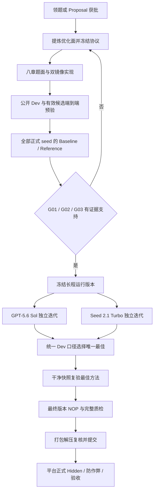

# AutoResearch 一道题制作与验证 SOP

规范快照：2026-10-05｜适用：三期 AutoResearch 专家出题；新任务卡/平台版本优先。

目标：从论文或获批 Proposal 中提炼一个研究问题，交付一套 Agent 能持续迭代、系统能自动评分、过程有真实证据、结果能在干净环境复现的科研任务。


快速定位：P0/P1 选题与协议；P2 双镜像；V01–V07 链路与隔离；V08–V10 成对实验；V11 双轨；V12 最佳复验；V13 NOP；V14 质检；第 11 节交付；第 12 节返修。检索词：artifacts、separate、3σ、Hard Gate、NOP、NOT_RUN。
本 SOP 根据项目内官方资料整理，作为执行方法和规范快照使用。是否已完成运行、获得什么分数，必须由当前题目对应版本的真实记录证明；本文件不是运行或平台验收证据。

配套执行表：[一道题制作与验证检查表](../assets/checklist.md)。执行时复制检查表到该题的专家证据目录，逐项填写实际结果。

## 1. 依据、适用口径与职责

### 1.1 已查阅的项目资料

|编号|资料|本 SOP 采用的内容|
|---|---|---|
|S1|[AutoResearch 三期培训流程说明](source-policy.md#s1)|领题、24h 初版仓库、资源申请、六步交付、提交字段与返修|
|S2|[作业详细教程](source-policy.md#s2)|操作顺序、证据归档、双轨时长、模型复评、NOP|
|S3|[AutoResearch 专家线下标注教程V3](source-policy.md#s3)|主要技术依据：双镜像、路径合同、八章题面、G01–G03、评分、隔离与证据 Schema|
|S4|[规范格式](source-policy.md#s4)|三大目录及 optimization_evidence 最小提交规范|
|S5|[autoresearch-task-qa v0.3.2](source-policy.md#s5)|2026-10-03 质检规则；G01–G03、QA01–QA21、Harbor H01–H06 与当前版本 NOP|
|S6|[autoresearch-baseline-quality](source-policy.md#s6)|Baseline 来源、实现健全、训练充分性、公平预算与选择完整性|
|S7|[PCA 教学对齐示例 README](source-policy.md#s7)|公开迭代与独立评分的文件映射；教学包尚未满足的正式验收要求|
|S8|[Autoresearch 难度打标PE](source-policy.md#s8)|环境轴 E、优化面轴 O、取高定级与证据置信度|

本文只查阅来源项目提供的资料及解压附件，没有在线核实飞书修订或平台当前部署版本。正式制作时，目标 Harbor 版本、任务卡与平台下发 Schema 需再次确认。

### 1.2 文档差异的执行口径

|容易冲突的内容|本 SOP 的执行口径与依据|
|---|---|
|S2 将 artifacts 示例放在 [verifier] 下|按 S3「task.toml」和 S5 Harbor 规则，使用**顶层** `artifacts = ["/workspace/solution"]`；在目标版本验证实际生效。|
|S4 树形图将 harbor_task 标注为 Agent 实际可见|按 S3，完整任务包只交平台，不能整体挂载给 Agent。Agent 只获得公开镜像内容与 Harness 提供的题面。|
|S4 列出源码 harbor_task/solution/|S3 明确其不是 Agent 构建输入；S5 明确源码 solution 是可选 Oracle。必需提交面是容器内 `/workspace/solution`，从 `environment/starter/` 初始化。|
|S4 示例写 Hidden 目录交付时为空|按 S3/S5，Hidden 材料必须有真实准备和调用依据；允许预置、生成或安全注入，不强制固定目录名，也不接受空目录或无依据的“平台会注入”。|
|教程顶部写 v0.3.1，下载附件为 v0.3.2|采用已解压的 v0.3.2 Skill 规则，尤其是最终版本 NOP 必交。|
|S5 使用说明推荐 audit_task.py --review，但本地入口参数不支持|已静态核对本地源码：audit_task.py 保留旧入口，implementation_review.py 支持 --review 并生成 schema 4 报告。本文命令使用后者，正式执行仍先检查实际版本的 --help。|
|旧提示词写 12h 或大于 15 轮|统一为两组**各有效 ≥10h**；仅满足全部例外证据时各 ≥7h。12h 是容器稳定性目标；没有统一大于 15 轮门槛。|
|旧示例单镜像、任务根 context、test.sh 只跑 pytest|不作为当前实现模板。采用两个独立 context，正式入口须实际评分并写 reward。|
|旧 5σ 强制、确定性固定 5% 提升|随机最低为 3σ_B，5σ_B 为强证据；确定性要求真实正向改善，不设通用 5% 门槛。|
|PCA 包能跑公开小样本|只能证明其已覆盖的教学接口；不能替代正式 B/R、双轨、Hidden、评分标定与 NOP。原生分数仍有截断等差异，正式使用需改造并重标定。|

这些裁定有 S3 正文与 S5 source-alignment/harbor-harness 支持；遇到后续新任务卡，应记录新口径和影响，不能默默混用版本。

### 1.3 三类执行要求

- **官方必需**：本项目明确要求，未完成或证据不足不能宣称该项通过。
- **官方目标/建议**：如单轮尽量 ≤2h、容器稳定至少 12h、Reference 剩余空间原则上 ≥3σ_B；需核验或说明风险，不能把建议改成无依据的一刀切淘汰规则。
- **本 SOP 操作建议**：如增加验证编号、文件指纹、限制负向探针、安排时长余量。用于减少返工，不新增平台 Schema 或强制目录。

专家负责题目设计、环境和评分实现、B/R 证据、两组 Agent、自验与材料整理。组长负责资源审批；平台/质检负责正式 Hidden 复现、防作弊、最终验收与难度/费用审核。专家说明中只能写实际自验事实，不能写“平台审核通过”。

## 2. 完成一道题的总流程



注意：两组 Agent 各自结束后，Harbor 才将其候选移交独立 Verifier。图中合流后的最佳选择只使用统一 Public/Dev 结果，不能根据 Hidden 反馈继续调优。

|阶段|关键输入|必须交付的阶段产物|进入下一阶段的条件|
|---|---|---|---|
|P0 领取与可行性|任务卡、论文、官方代码、资源条件|题目身份、权限、预算、初步优化面|材料可用；自行选题已获项目组确认|
|P1 研究协议|问题与代码调用链|优化面定义、固定协议、正式 seed、质量门|真实方法空间且能程序评分|
|P2 环境与评分|协议与 Starter|八章题面、双 Dockerfile、配置、公开/私有评分|接口、路径、依赖、约束均可执行|
|P3 预通验证|初版任务包|公开评分及有效候选移交证据|目标环境能完整出分，隔离成立|
|P4 B/R 证明|同协议的两种实现|成对结果、日志、条件性模型、统计汇总|G01–G03 有完整证据支持|
|P5 双轨长程|冻结任务包、同一 Prompt|两组独立方法迭代与时间记录|各自有效时长合规，候选恢复完整|
|P6 最佳复验|公开有效候选|唯一 best_method 和干净复验记录|可直接替换 solution 并出分|
|P7 NOP 与质检|最终任务版本、全部证据|同次 NOP 记录、完整 QA 报告|无明确失败；待补证项已解决|
|P8 打包提交|三个交付目录|三个平台提交项及自检结果|解压复核成功，材料已上传|

## 2.5 ★ 五道不可跳级里程碑（shift-left QA，2026-10-07 吸收）

检查不再集中在最后，而是**五道按序门禁**——任一未过不进入下一阶段。
依据：本项目 9 条题线的失败全部属于"问题在长跑/打包后才暴露"，而事后新增计算只扩大返工面。

| 里程碑 | 必须已具备 | 失败动作 | 对应阶段 |
|---|---|---|---|
| **M1 selection** | 论文身份、许可边界、方法级优化面、题库权威状态 | **换题或补证；不写题面、不租卡** | P0/P1 |
| **M2 pilot** | B/R receipt、独立复算、效应/噪声结论 | **修协议或拒题；不启动双轨** | P1.0/P1.1 |
| **M3 container** | Agent/Verifier 镜像 digest、Hidden 隔离、完整 trial | 修构建与路径；**不计长跑时长** | P2/P3 |
| **M4 long_run** | 两条独立血缘、闭合有效时长、机外快照与恢复 probe | 补真实运行；**不拼接旧轮次** | P5 |
| **M5 release** | 两份独立 QA、聚合共识、隐私报告、白名单 manifest | 任一失败即 **NOT READY** | P7/P8 |

**执行工具**：`tools/milestone_gate.py --milestone M1|M2|...`（M1/M2 真实数据判定；M3–M5 核对证据引用）。
**最小返修循环**：① 只修当前最早失败项，后续暂停 → ② 新 run/trial ID 重跑最小证据 → ③ 比较修复前后冻结合同与来源哈希（确认没换题/换分母/换 evaluator）→ ④ 重跑本门禁**及所有受影响上游门禁** → ⑤ 通过才恢复下一阶段。
**不保证零返修**：目标只是让失败尽早、边界清楚、可重放。

## 3. P0：领取、资源和可行性核对

**输入**：候选论文/代码/数据；或平台已确认的 Proposal。

1. 题库领取：在领题表选择待领取题，填写自己的飞书账号，确认状态变为已领取。
2. 自行选题：填写专家、所属群、论文标题与链接、方向、优化面；等待查重和难度检查通过后正式开工。
3. 记录 Task ID、题目模式 S1/S2/S3、领取时间、论文与官方实现版本、变体编号。
4. 核对代码/数据使用权限、下载访问条件、预训练权重与离线可用性。
5. 确认 CPU、GPU 型号/数量、内存、磁盘、网络、单轮时限、产物大小；明确本机是否具备 Docker daemon。
6. GPU 需求按规格 × 数量 × 天数估算训练总成本，按项目流程先报小组长审批，再使用。
7. 先判断能否切出一个边界明确、可程序化评测、单轮资源可承担的子问题。无需复现整篇论文。

**规则**：题库题未完成最多同时保留 3 道；领取后 24h 内上传初版 harbor task 代码仓，否则可能自动释放。自行选题按 S1 不受题库三道题和释放时间限制。初版上传不等于正式完成，状态必须如实填写。

**退出条件**：资料可访问、用途可解释、预算能承担，且一句话能表达：

> 给定【输入/Starter】，Agent 可以改【真实方法对象】，在【固定条件与预算】下提高【指标与方向】，不得改变【数据/评测/受保护面】。

**不可行处理**：换切入点、合理压缩双方协议，或按领题规则释放题目；不能以削弱 Baseline 制造可行性。

## 4. P1：定义优化面并冻结正式协议

### 4.1 研究问题设计

1. 定位论文贡献在官方代码中的模块、接口和运行路径。
2. 列出允许改变的对象：例如损失形式、采样/更新规则、模型模块、检索或推理策略。
3. 列出固定对象：数据版本与切分、评分器、质量门、预算上限、保护文件、网络与工具政策。
4. 检查候选解析器/guard 是否真正允许实现新方法。题面写“允许创新”但执行只接受常量字典，不合格。
5. 在**专家私有说明**中记录可行 Reference 与至少一个题面未直接提示的合法后续方向；不要把解法提示写入 Agent 题面。
6. 判断是否随机、是否训练/微调。固定 seed 不足以证明确定性；同一模型多次随机评估不是多次独立训练。

固定任务仅搜索学习率、epoch、loss/ridge 权重等一组数值，不属于本批次要求。若研究对象本身是 HPO 算法，允许实现搜索策略并在未见任务上按预算评估，则需按其实际方法空间判断。

### 4.2 协议冻结清单

|对象|必须明确的内容|
|---|---|
|数据|来源、版本、数据指纹、train/dev/hidden 边界与预处理；Dev 不用于训练|
|指标|原始指标名称、单位、方向、精确公式、聚合顺序、缺失值处理|
|质量门|正确性、精度/相似度等下限；不合格方案不能仅靠速度进入最佳排序|
|随机性|正式 seed 全集；独立训练 seed 与 evaluation replicate 分开记录|
|预算|CPU/GPU/内存/时间/磁盘/产物大小与网络；双方同预算上限|
|候选接口|实际文件、函数/CLI、输入输出、模型/配置路径与解析规则|
|选择规则|checkpoint、公开最佳方案及重复评测的统一选择和聚合方式|
|评测边界|公开反馈、最终私有评分、Hidden 供给方式与授权自验范围|
|版本|题目源代码、数据、依赖、Harbor/provider、协议标识|

默认至少各 3 次独立正式运行；波动较大至少各 5 次；任务已有完整正式 seed 集时以其为准。用了 5 个就完整交 5 对，不能裁为 3 对。

协议可直接写入 `训练证据说明.md` 和每轮 `result.json`，不必新增重复的 experiment_plan 等文件。修改协议后必须重新识别版本，并重做受影响证据；旧结果不能和新结果混算。

### 4.3 探针优先与判定预解（2026-10-07 实战新增，强制）

正式 B/R 之前必须先完成两件事，未完成**禁止**投入全 seed 协议。完整依据与案例见 [实战教训](field-lessons.md)（L1–L5）。

**① 增益探针（P1.0）**：用官方脚本原样、**论文主打规模**，跑 **1 seed × (B+R)**，预算 ≤ 2× 单跑耗时。
- 通过条件：Δ 为正且量级足够（见下 ② ）；不通过 → **立即停**，改切入点或换论文，不许以"再跑几个 seed 看看"扩大投入。
- 探针产物全部保留：协议不变时它**就是**正式 B/R 的 seed 1，可直接计入。
- 顺带实测单跑耗时（不要用"论文 epoch 数 × 猜测速度"），用于校准 `time_limit_seconds` 与预算。

**② 判定预解（纸面，零成本）**：用 1 个 seed 的 B/R 与真值侧地板 U，预解两道门是否存在**可行交集**：

```text
minimize 情形：
  ① R_norm 合规：B_mean ≥ (R_mean − 0.15·U) / 0.85
  ② 3σ 门：Δ = B_mean − R_mean ≥ 3σ_B，σ_B ≈ seed 散布决定
写出两者对"seed 散布"的依赖 → 若不存在可行交集，则该 (指标, 规模, 协议) 结构性不可行
```

**实战反例**：某题 `R_norm ≥ 0.15` 需 B_mean 比 seed1 高 9%，而达到该 B_mean 需要 seed 间差异 ≈0.012 ⇒ `3σ_B ≈ 0.035 > Δ ≈ 0.005–0.018` → 两门互斥、跑之前即可判定死局（本轮因此白烧 ~150 元）。

**③ 指标直译论文主张**：自造指标须在协议里写明与论文主张的映射；**优先复用论文主图/主表的指标**。判据：论文机制若完美实现，该指标应产生论文声称的量级差异；否则指标选错（本轮根本失误）。

**④ 跨规模超参须数值反推**：拿官方在**已有规模**上的取值与数据统计量对比，反推其真实意图；不按文档字面为新规模重算。扫描候选 ≤4 个，每个能说明"对应文档/代码的哪种读法"，并用探针规模跑。

**退出条件**：G01 方法空间成立；评分可程序化；B/R 比较协议能固定且资源可承受；**探针通过且判定预解存在可行交集**。

## 5. P2：构建题面、双镜像与评分链路

### 5.1 推荐交付目录

```text
submission_root/
├── workspace/
│   ├── harbor_task/
│   │   ├── instruction.md
│   │   ├── task.toml
│   │   ├── environment/                    # Agent build context
│   │   │   ├── Dockerfile
│   │   │   ├── requirements.txt
│   │   │   ├── starter/
│   │   │   ├── public_eval/                # 每轮公开评分
│   │   │   └── public_assets/              # 需要的公开 train/dev/资源
│   │   └── tests/                          # Verifier build context
│   │       ├── Dockerfile
│   │       ├── test.sh
│   │       ├── grader.py 或评分包
│   │       ├── requirements.txt           # 按依赖需要提供
│   │       └── 私有资产或生成/注入实现
│   └── reference/                         # 专家完整可执行 Reference
├── expert_evidence/
│   ├── 专家作业说明文档.md
│   ├── expert_annotation.json
│   ├── run_summary.json
│   ├── trajectory_codex.json
│   ├── trajectory_seed.json
│   ├── best_method/
│   └── validation/                        # SOP 建议归档位置，不是固定官方目录名
└── optimization_evidence/
    ├── 训练证据说明.md
    ├── README.md                          # 推荐
    ├── baseline_runs/seed_<真实seed>/
    ├── reference_runs/seed_<真实seed>/
    └── comparison_summary.json
```

内部方法文件名按优化面确定，不强制 `method.py`。不训练时不创建空 train/model 目录。源码 Oracle 解法目录可选；不要用它初始化 Agent 以泄露答案。

### 5.2 权限与信息边界

|对象|Agent|Verifier 可信进程|Verifier 内候选进程|
|---|---|---|---|
|公开题面、Starter、Public/Dev|读取；公开资产与 Starter 按题面只读|按正式合同使用|仅接收允许的输入|
|运行时 /workspace/solution|按题面修改并提交|读取、校验、受限执行|按受限接口执行|
|最终私有评分器、Hidden 标签/参考答案|不可见|读取并计算真实评分|不得读取或修改|
|最终 reward|不可写；不作为迭代反馈|清理并原子写入|不得伪造或修改|
|workspace/reference 与两类完整证据包|不可见|平台/专家按需审阅|不可见|
|单组本次新轨迹输出位置|仅写入本组新产物|不作为候选评分输入|不移交|

### 5.3 写 instruction.md 八章

|章节|必须写清楚|
|---|---|
|Goal|输入、输出、优化目标与合法提交定义，不写具体解法|
|Task Setting|环境、起点、公开 Dev、最终 Hidden 隔离|
|Objective and Metrics|原始指标、方向、公式、聚合、质量门、B/U 与随机性阈值|
|Allowed Scope|准确的可改路径、可读公开资源和真实公开评测命令|
|Hard Boundaries|保护面、网络/工具政策、资源/单轮时限/产物限制、禁止行为|
|Submission Instructions|真实提交文件、接口/Schema、必要模型配置与评分器解析方式|
|Workflow & Iteration|修改→公开评测→判断→保留/回退→恢复当前最佳|
|Completion Criteria|接口与质量门通过、有限分数、必需产物齐全、边界未破坏|

不能保留模板注释；不泄露论文标题、arXiv ID、解法仓库、Reference 方法或 Hidden 样本/答案线索，除非任务明确允许。无需强制不存在的 submission JSON。题面写单轮预算，Agent 总有效时长放在运行配置、共同 Prompt 和专家摘要中。

### 5.4 task.toml 关键执行合同

下列只是最小关键配置片段，资源、超时与 metadata 按目标版本补齐：

```toml
# 顶层：必须在任何 [table] 之前或以正确的顶层组织方式声明
artifacts = ["/workspace/solution"]

[verifier]
environment_mode = "separate"
```

TOML 在 `[verifier]` 后写 `artifacts` 会归属该表，而不是顶层。仅语法可解析不代表 Harbor 接受或字段实际生效。使用平台指定版本的原生 Schema/provider；`schema_version = "1.3"` 是样例值，不保证任意部署支持。

资源预算分别配置 Agent 与 Verifier；Build/Setup/Agent/Verifier 超时、单次运行预算不是同一个值。示例 16 CPU、64GB、1 GPU、10MiB 不是每题固定要求；S3 给出的通用资源边界为 CPU ≤64C、单 Job 默认 ≤8 GPU，优先 H20/L20，最终以任务卡和审批口径复核。

**补充（2026-10-09 auto2001）：四项会阻断原生运行的契约（送检前必过，见 L19）**

1. `[task].name` **必填**（`<owner>/<slug>`）。缺它时 CLI 报 `Either datasets or tasks must be provided`，
   容易被误当作命令行用法问题。
2. `network_mode` 是**枚举**：仅 `no-network` / `public` / `allowlist`；`"none"` 会报 `Input should be 'no-network', 'public' or 'allowlist'`。
3. `[verifier].environment_mode = "separate"` 必须显式声明。
4. `[environment] build_timeout_sec` 必须显式声明：默认 600s，
   而含 torch 的镜像**首次构建实测 1578s**，会报 `Environment start timed out after 600.0 seconds`。

判定器（只读，三态退出码）：

```bash
python tools/harbor_task_contract.py --task <harbor_task 目录>
# 0=通过 / 1=原生必挂 / 2=需人工确认
```

本机装了目标 Harbor 时会用其 `TaskConfig` **真加载**（最权威）；
否则退回内置判据。**“TOML 能解析”不等于“原生接受”。**

另一条并行纪律：题包一旦送检被锚定，**不再改任何字节**；
送检后才发现缺陷的，走返修上报，由平台按新哈希复核（L20）。

### 5.5 实现两套镜像

1. Agent 镜像：固定基础镜像和依赖；从 `starter/` 分别初始化只读 `/workspace/starter`、可写 `/workspace/solution`；提供公开评分器与公开数据。
2. Verifier 镜像：独立准备 `/tests/test.sh`、可信 grader、全部评分依赖、私有资产或其准备接口；不依赖 Agent 临时装包或缓存。
3. 两套 COPY/ADD 源分别相对自身 context，不得 `COPY ../`；检查 ignore 规则不会漏掉必需文件。
4. 不把整个提交包、Git 答案历史、Reference、两类证据包、私有资产复制到 Agent。后续删除文件不能证明早期镜像层没有泄露。
5. 采用受控用户、权限及网络政策；只写 `chmod` 或文件夹名字不能证明保护生效。

在提交包根执行以下真实 Docker 构建命令；构建输出应保存，不能将这两条命令当作完整 Harbor 验证：

```powershell
docker build -t task-agent:local -f workspace/harbor_task/environment/Dockerfile workspace/harbor_task/environment
docker build -t task-verifier:local -f workspace/harbor_task/tests/Dockerfile workspace/harbor_task/tests
```

有 Docker CLI 但 daemon 不可用仍无法验证。AutoDL 普通容器实例可用于算法/Dev 开发，不能据此宣称完成双镜像与 Harbor 自验；完整验证放到具备 Docker 能力的环境。

### 5.6 公开与正式评分实现

> **★ 官方仓复用清单与易错点**（2026-10-07 实战，详见 [实战教训](field-lessons.md) L4/L8）

复用论文官方仓时先做这三件事，能省掉整轮返工：

1. **官方常量的数值反推**：把官方在已有规模的取值与数据统计量对比，判断其**真实意图**（"吸引子内软约束"还是"吸引子外硬约束"），再决定跨规模如何换算——不要按文档字面为新规模重算。
2. **按官方目录布局铺依赖、不改官方脚本**：多数脚本用 `sys.path.append('../')` + `from utilities import *` / `from fno_2d import *`；把 `utilities.py` / `dissipative_utils.py` / `models/fno_2d.py` 铺到脚本父目录，避免 `ModuleNotFoundError`（改脚本会破坏"官方原样"的可辩护性）。
3. **checkpoint 与参数的三处硬编码**：官方常 `torch.save(model, path)` 且**文件名无扩展名** → 用 `run.log` 的 `Weights saved` 判断完成、按"最大的非 json/log 文件"定位权重；pickle 引用官方模块名 → 转换脚本须把官方仓 root 与 `models/` 加入 `sys.path`；`domain_size` 常被硬编码 → 转换器显式传参**并做一次前向尺寸校验**（否则 rollout 阶段才报 `shape invalid`）。

每轮公开链路：候选→可信 Public/Dev 入口→状态、原始指标、公开反馈→下一轮方法决策。

最终链路：Agent 退出→Harbor 仅收集 artifacts→独立 Verifier 同绝对路径恢复→`bash /tests/test.sh`→可信评分与约束校验→写 reward→Harbor 收集。

- 正式入口不能假设 cwd 是 `/tests`，使用明确绝对路径或脚本自身定位。
- reward.txt 必须是单个有限数值；reward.json 必须是非空有限数值对象，例如 `{"reward": 0.3}`。NaN/Infinity 不合格。两者同时存在时按目标 Harness 的读取行为核对，质检按 reward.json 优先。
- 不信任候选自报分数；先清理陈旧结果，再由可信进程原子写入。
- 候选在 Verifier 中仍是不可信代码。不得直接导入拥有私有标签与写 reward 权限的 grader 进程后宣称隔离成立；采用候选降权、受限子进程/文件边界等机制，并验证实际权限。
- Hidden 材料可以预置、生成或安全注入；需保存来源/指纹、准备入口、评分读取路径与权限依据。只有“平台会注入”一句话不够。
- 暂无正式 Hidden 授权时用同接口授权自验数据跑链路，单独标记其 split 和身份；正式 Hidden 状态仍为待平台复现。

## 6. P3：验证 SOP——环境、评分与端到端预通

本章验证发生在长程 Agent 之前；第 7–9 章补充研究统计、时间、最佳方法与最终 NOP 验证。每次验证记录版本、真实命令、时间、退出码、结果路径与执行范围。未实跑写 `NOT_RUN`；遇到缺证写待补证，不能写通过。

### V01：路径、配置与题面静态对齐

**操作**：核对真实 task 根；逐项阅读题面、完整 TOML、双 Dockerfile、公开入口、test.sh 及其调用链。用可信 TOML 解析器验证语法，按目标 Harbor 原生 Schema/provider 验证配置；核对 artifacts、separate、模型/配置路径和超时覆盖。

**通过**：八章内容有效；配置位置/类型正确；所有入口与构建源存在；题面合同与运行合同一致；无候选必需文件落在未移交路径。

**证据**：目标版本/CLI help 或平台启动模板、检查结果、文件位置、版本说明。静态通过只支持配置对齐，不能代替运行。

### V02：双镜像冷构建与依赖验证

**操作**：在 Docker 可用环境按两个 context 构建；启动两个镜像，检查必要解释器、依赖、入口和数据；根据网络合同验证运行期断网仍能工作。

**通过**：两侧分别构建/启动成功；Verifier 无需 Agent 缓存或本机临时挂载；基线及评分依赖固定、可追溯。

**证据**：两侧 build/start 日志、退出码、镜像标识与实际依赖版本。

**补充（2026-10-09 auto0340 实测；三类缺陷静态检查器全 PASS，只有真机构建才暴露 —— 见 L24/L25）**：

1. **构建前跑 Dockerfile 前置断言**：CR=0、**行尾双反斜杠=0**、`FROM` 行含期望基础镜像。
   行尾 `\\` 会让下一行被当成独立指令 ⇒ `dockerfile parse error ... unknown instruction: -e`，镜像根本建不出来。
   ```bash
   python3 -c "raw=open('tests/Dockerfile','rb').read(); print(raw.count(bytes([92,92,10])))"   # 必须 0
   ```
   ⚠️ **不要用 `grep -c $'\r'` 数行尾**（Git Bash 下是假阳性）；一律用 `tr -cd '\r' | wc -c` 或 Python 数字节。
2. **基础镜像的 Python 版本必须与依赖闭包匹配**（构建前一条命令即可判定）：
   ```bash
   docker run --rm ubuntu:22.04 bash -c 'apt-get update -qq && apt-cache policy python3.9 | head -3'
   ```
   实测 22.04 返回 `Candidate: (none)`（源里只有 `python3.10`），而 `torch==2.2.2+cu118` + `numpy==1.23.5`
   要求 Python < 3.10 ⇒ **组合自相矛盾，构建必挂、正式评分同样挂**。换 20.04 + deadsnakes。
3. **构建期加 import 自检**，比事后排查便宜得多：
   ```dockerfile
   RUN python3 -c "import torch, torchrl, tensordict, gym, dm_control; print('imports OK')"
   ```
4. **用了 `--no-deps` 就必须显式偿债**：它会把该包的依赖一起跳过（实测 `tensordict` 缺 `orjson`
   ⇒ 评分脚本 import 阶段即崩）。用 `pip show <pkg>` 的 `Requires` 字段列全依赖并钉版本，
   且要与离线 wheel 源中**实际存在的版本**对齐。**本地 `--no-deps` 变体必须回写进交付件**。
5. **构建后对照 hard_gate / 入口的必需件清单**：工作区由 `starter/` 复制而来时，
   必需件必须存在于 `starter/`，否则**任何提交都被判违规**（实测 `[hard-gate] FAIL [G5] 缺少 submission.json`，
   reward 恒 −1）：
   ```bash
   docker run --rm --entrypoint /bin/bash <agent-img> -lc 'ls -la /workspace/solution/'
   ```

### V03：Public/Dev 反馈闭环

**操作**：在全新 Agent 容器用未修改 Starter/正式 Baseline 调用题面公开命令；小样本 smoke 仅测接口，随后用正式 Dev 协议出分。进行一次合法方法变更，确认评分确实执行新版本并给出可用于下一轮的反馈。

**通过**：正常/失败状态清晰；原始指标有限；正确性质量门有效；反馈来自实际评分而非候选自报；执行版本与结果可对应。

**证据**：完整输出、候选版本、评分状态与数据身份。小样本结果不能写进正式 B/R 结论。

### V04：评分数学与失败语义

本项分为**接口预验**和**正式标定复验**：P3 可先验证原始评分、公式与失败接口；正式 B/R 均值需等待 P4 实验完成后才能写入锚点并复验。合成数学输入或 smoke 结果不得冒充正式 B；未标定时明确标记该部分待验证，不提前宣称 Reference 范围通过。

令 B 为正式 Baseline 均值、R 为 Reference 均值、U 为有依据的预计可达值。分数始终越高越好：

```text
maximize：score(x) = (x - B) / (U - B)，要求 U > B
minimize：score(x) = (B - x) / (B - U)，要求 U < B
```

**操作**：从真实评分表达式核对方向、聚合与 B/U；分别检查 x=B、x=U、中间值、劣于 B、优于 U，以及缺失/非有限输入；确认没有 Reference 分段锚定或内部 clipping。多目标核对单位、权重、聚合顺序。以下代入使用合成数学输入，不冒充实验证据。

|输入/状态|预期|
|---|---|
|合法 x=B|score=0|
|合法 x=U|score=1|
|合法值连续变好|分数连续单调增加|
|合法方案劣于 B|可得到负分，不能因负分就当无效|
|合法方案超过 U|允许 >1，不裁剪|
|B=U、错误方向、NaN/Infinity|明确配置/评分错误，不输出成功结果|
|非作弊 Hard Gate 违反|返回 -1 并标记无效，不参与正常排序|
|格式错误、超时、资源超限、基础设施故障|分别记录失败类型，不全部折为 -1 或 0|

**通过**：公式连续单调、无裁剪；R 在声明的 Public/Dev 协议下归一化为 [0.15,0.8]；U 有独立依据。合法负分与无效 -1 必须结合状态区分。

**证据**：计算记录、评分源码与锚点来源；本次合成输入验证范围。不要只在封顶后的原生分数外套线性变换就声称已消除饱和。

### V05：硬约束与候选隔离验证

**操作建议**：在可丢弃测试环境，用受控探针验证下表，不使用真实敏感标签外泄作为探针。测试身份必须和 Agent/候选实际身份一致，不能用 root 探针代替受限进程。

|核验对象|验证动作|预期与处理|
|---|---|---|
|公开资产/评分器与冻结文件|尝试写入或提交修改版|拒绝、可信恢复或校验判定生效；不可只依赖文字禁令|
|Agent 私有材料边界|检查最终文件系统、镜像 COPY/层、挂载、环境变量、日志、缓存/Git 线索|无 Hidden 标签、Reference 或他组证据可达|
|Verifier 内候选读取边界|受限候选读取预置测试哨兵代表的私有标签/参考位置|拒绝读取；可信 grader 仍能正常访问|
|可信评分器与 reward 写权限|候选尝试改写测试文件/预写伪分|拒绝改写；旧结果清理，真实评分覆盖/原子落地|
|超时/CPU/GPU/内存/磁盘/产物限制|在批准资源内设计可控超限样例|限制可观察地生效，错误分类明确|
|符号链接与路径越界|提交指向合同外测试文件的候选|按合同拒绝，不越界读取或移交|
|网络与工具政策|按声明检查联网/检索与可写路径|实际允许/禁止行为与题面一致|

**通过**：所有题面硬约束有实际执行机制，敏感边界和评分写权限有效。探针清单是本 SOP 操作建议，不是静态 Skill 对每项强制要求的独立报告格式。

**失败处理**：候选能读标签、改评分器或伪造 reward，说明隔离实现失败，必须返修环境；不能仅扣分继续运行。

**证据**：测试身份、命令、权限/挂载观察、预期与实际结果。静态 QA07/08 通过不能替代本项。

### V06：有效候选的 Harbor 端到端评分

**操作**：使用目标版本/平台任务卡的启动命令，投入合法可执行候选，让 Harness 完成结束、artifacts 收集、独立 Verifier 恢复、评分与 reward 收集。不能在宿主机直接执行未知候选/test.sh 来代替这一链路。

逐项核验：

1. Agent 与 Verifier 确为独立环境，separate 实际生效。
2. 只移交合同中的候选代码/模型/配置；不移交 /logs、reward、Reference 或整个工作区。
3. Verifier 中恢复路径仍为 `/workspace/solution`，相对布局保持；可核对提交文件指纹。
4. test.sh 真正进入有效候选计算分支，读取授权数据，计算真实指标。
5. 实际资源/依赖满足要求，reward 有限且和 Trial 收集结果一致。
6. Agent 已退出，未收到可用于继续优化的最终 Hidden 反馈。

**通过**：有效候选全链路出分；分数、版本、候选与数据身份一致。仅 NOP 缺提交早退分支或手工 docker run 成功不足以证明本项。

**证据**：同次 Trial 的 config/result/reward/日志、版本与候选对应关系、实际启动命令、平台结果位置；授权自验与正式 Hidden 分开标记。

### V07：资源与环境稳定性

**操作**：观察声明资源内 B/R/评分能否完成；运行期记录 OOM、FD 泄漏、磁盘/日志/产物积累和利用率；核对单轮耗时与容器稳定性记录。

**通过/复核**：硬资源限制真实生效；单轮尽量 ≤2h；容器应能稳定存活 ≥12h。未达建议目标时说明原因、实测和平台复核依据，不能虚称通过压测。容器 uptime 不等于 Agent 有效时间。

**证据**：资源/进程与时间日志、真实异常与处理、稳定性执行范围。

**P3 退出条件**：V01–V06 的接口与链路部分有支持证据，V07 已验证或按要求记录并提交复核；正式锚点部分可待 P4 完成。先采集 B/R、完成标定复验，再投入长程迭代。

## 7. P4：正式 Baseline/Reference 实验与研究质量验证

### 7.1 执行步骤

1. 固定两份源码及方法/依赖哈希；Reference 独立存放 `workspace/reference/`，不混入 Starter。
2. Baseline 默认未修改 Starter；仅 Scaffold 时，额外提供专家侧合理朴素实现，并说明源码、入口与评分零点 B 的映射。
3. 按正式协议对每个真实 seed 分别从初始化独立运行 Baseline 与 Reference，使用同数据、质量门与预算上限。合法共享预训练起点可声明，不能复制完成训练的模型冒充新训练。
4. 保存全部 stdout/stderr、warning、失败和退出信息。失败标 `INVALID`，未跑标 `NOT_RUN`；缺失真实信息填 null 并说明，不倒推生成。
5. 训练型保存每 seed 实际模型及重载证据；非训练型记录必要产物与哈希，不创建空 model/。
6. 只从逐 seed 真实 result.json 重算 comparison_summary；填写 G01/G02/G03 及已知缺口。

### V08：Baseline 合理性与比较公平

检查来源与选取理由、输入/标签/损失/更新/推理路径、计划与实际 steps/tokens/样本量、曲线与停止原因、数据/预算/调参机会、全部 seed 与 checkpoint 选择。

合理经典/朴素方法可以作 Baseline；年份旧、分低或 Reference 提升大不能单独判不合理。仅给 B 减数据、少训练、禁关键输入或错误实现，而 R 用正常协议且这些不是允许研究变量，比较不合格。

研究训练效率时按同计算/时间/token 预算比较，不机械要求同 epoch；模型架构/容量是优化面时不机械要求同容量。已批准 debug 题必须另有健康对照，不能把恢复故障当一般方法创新收益。

**证据与通过**：S6 B01–B08 的适用事实足以支持“在已提供材料范围内合理”，无核心公平性缺口。仅缺日志不能直接断言故意削弱，但必须补证后才能支持结论。

### V09：模型独立重载与复评分（训练型必需）

1. 对每份真实 checkpoint 计算 SHA-256 和大小，并绑定 role/seed/源码哈希。
2. 启动干净进程或容器，仅加载已保存模型；不重训、不读取原进程内状态。
3. 按原正式评测协议复评，保存完整 `reload.log`。
4. 比较重载与原始指标；确定性要求一致，存在随机性时按事先声明的容差/协议判断。

PowerShell 哈希示例：

```powershell
Get-FileHash -LiteralPath '实际模型路径' -Algorithm SHA256
```

**通过**：每个必需模型存在、哈希正确、可独立加载并复评符合协议。缺失、损坏、哈希不符或无法重载的运行不是完整训练证据；reload.log 由专家实际执行生成，不是 Harbor 自动产物。

### V10：成对统计、提升与剩余空间

正式 seed 对应原始指标记为 B_i、R_i，n 为完整配对数：

```text
B_mean = mean(B_i)
R_mean = mean(R_i)
sigma_B = sqrt(sum((B_i - B_mean)^2) / (n - 1))

maximize：delta_i = R_i - B_i；Delta = R_mean - B_mean
minimize：delta_i = B_i - R_i；Delta = B_mean - R_mean
Reference_normalized = Delta / abs(U - B_mean)
```

**操作**：核对每对 seed/role/协议/状态/质量门/源路径；复算两组均值、n−1 样本标准差、逐 seed 改善、平均绝对/相对改善与归一化。相对改善的分母/零值处理需声明，无法定义时填 null。

**判定**：

- 所有正式配对完成有效、训练型模型全重载通过，汇总才可 `COMPLETE`；不能删除失败后仍把正式全集标完整。
- 所有任务要求真实正向改善 `Delta > 0`；Reference 公开归一化在 [0.15,0.8]。
- 随机评估要求 `Delta ≥ 3*sigma_B`；3–5σ 可接受并应增跑/标记复核，≥5σ 为强证据。
- 不得以标准误、配对差标准差或 Reference 方差替代 Baseline 样本标准差。
- σ_B=0 仍须 Delta>0；零样本方差不证明整体确定性，不需伪造“无限 sigma 倍数”。
- 确定性不设通用 5% 门槛；额外预声明容差仍需核验。
- U 必须有理论/方法/资源依据，不能看结果后调 U 制造达标。R 到 U 的剩余空间原则上 ≥3σ_B，不足时说明风险并复核方法空间，不升级为未声明硬门。
- 个别配对改善可受噪声影响；记录全部真实值，按聚合和质量门判断，不要求无依据的“每个 seed 都胜出”。

**教学计算例（非本题实测）**：maximize，B=[0.59,0.60,0.61]、R=[0.64,0.65,0.66]，B_mean=0.60、R_mean=0.65、σ_B=0.01，Delta=0.05=5σ_B。若 U=0.70 且有独立依据，Reference_normalized=0.50，处于规定范围。此数字不得复制进真实交付证据。

### V10 补充：取数口径必须先"按评测调用点去重"，再算 Delta（2026-10-07 实战新增，见 L29）

在把 B_i / R_i 代进上面的公式**之前**，必须先确认那两个数确实是"官方指标"。
实测（`al4pde`）一个 AL 轮会连着打**两次**评测，且**两次的日志行形状完全相同**：

```
{'al_iter': N, ..., 'nRMSE': tensor(X)}   ← al/         官方 val（取这个）
{'al_iter': N, ..., 'nRMSE': tensor(Y)}   ← al_new_data/ 新选数据（不取）
```

- 只有 wandb 的 `prefix` 能区分，**stdout 上没有 prefix**；`time_step_name` 两次相同。
- **官方口径 = 每个迭代的第一次评测**；末轮常因 `if not last` 抑制第二次，只剩一个，
  此时"最后一个"恰好等于"第一个"。
- 取错的后果：同一 run 内实测 `al_iter0` 官方 0.0497 vs 非官方 0.0909（差 83%），
  **不报任何错**，但会让整批对照的 Delta 失真。

**两步操作**：

```bash
# ① 先读 runner：数清每个迭代打几次评测、谁先谁后
grep -n "evaluate(" <runner.py> <evaluation/*.py>
# ② 按迭代分组取「首个」，不要用 tail -1
grep -E "^\{'al_iter':" run.log \
  | sed -E "s/.*'al_iter': ([0-9]+).*'nRMSE': tensor\(([0-9.eE+-]+).*/\1:\2/" \
  | sort -t: -k1,1n -u
```

**交叉验证（做一次即可，把"口径正确"从假设变成证据）**：用 V09 的独立重载脚本，
**只喂官方 val loader** 复评一个已知 checkpoint；若复现值等于按上述规则取的终值
（本例 `0.0153 == 0.0153`，rel_diff `0.000%`），说明口径取对了。
**若两者不等，先怀疑取数口径，再怀疑模型。**

**同时**：宣布"某类方法全部失败"之前，必须先枚举-勾选候选目录下的全部配置
（`ls config/acquisition/*.yaml` 之类），逐条标 `已测/未测/不可用`；
只要还有"未测"就不得下"全部失败"的结论（见 L28：6 次全负后漏测的三个里，
`lcmd` 恰是唯一优于随机的）。

### 7.2 每 seed 必需文件

```text
optimization_evidence/<baseline_runs 或 reference_runs>/seed_<真实seed>/
├── result.json
├── run.log
└── model/                          # 仅训练型
    ├── model.<实际格式>
    ├── artifact.json
    └── reload.log
```

`result.json` 至少包含：schema_version、status、role、seed、task_type、method、protocol、training、execution、metrics、quality_gate、artifacts。

- method：名称、源码路径/SHA-256、必要固定依赖哈希。
- protocol：数据/训练/评测口径、方向、质量门与预算。
- execution：真实命令、起止、退出码、耗时与资源；缺失填 null 并解释。
- artifacts：相对提交包根目录的真实日志/模型/核心产物路径与哈希。
- artifact.json：模型路径、格式、大小、SHA-256、role/seed、方法哈希和重载结论。

**P4 退出条件**：G01 真方法空间、G02 合理公平基线、G03 完整有效提升均有证据；真实 B/R 与有依据的 U 已写回同协议评分/标注并重做 V04，更新配置时同步复核 V01/V06。Reference 不是唯一答案或封顶解，仍有持续研究空间。

## 8. P5：两组 Agent 独立长程迭代

### 8.1 启动前冻结

1. 冻结题面、Starter、环境/评分、公开数据、资源、正式协议与共同 Prompt；记录版本对应关系。
2. 两组从同一任务快照起步，各自使用独立容器/输出位置；不能共享候选、轨迹、答案或先前私有证据。
3. 固定组合：`Codex + GPT-5.6 Sol`、`Codex + Seed 2.1 Turbo`；默认最大推理档位。不能以当前助手或其他模型冒名替代。
4. 使用任务卡/目标 Harbor 的真实启动方式。本文不虚构未确认的 harbor CLI 参数。
5. Agent 每轮在同一任务容器内改代码并调用公开评分，不因每次修改重建镜像，不每轮调用 Hidden。

### 8.2 共同 Prompt 必须包含的内容

先读取题面并完整运行起点；只在允许范围内提出和实现方法，按同一 Public/Dev 协议评价。每轮写八字段，失败留档；改进有效时保存当前最佳。结束前复测最佳并把代码、模型与配置恢复到 `/workspace/solution`；不要把最后一次失败试验交给 Verifier。

总有效时长要求放入共同 Prompt 和运行配置；不得访问 Hidden/Reference、他组轨迹或篡改评分。每组只使用本次新建的空白日志输出位置，不能把汇总后的 expert_evidence 挂进去。该输出位置不是移交给 Verifier 的 artifacts。

### 8.3 每轮闭环与八字段

一轮：方法假设→实现→公开评测→检查状态和质量门→同口径判断→保留/回退→记录下一决策。

|字段|含义|
|---|---|
|round|实际轮次，顺序一致|
|policy_name|方法/策略名称|
|method_summary|1–3 句话描述改动、观察与结论|
|status|真实运行/评分状态|
|score|实际 Public/Dev 原始指标；未知/失败为 null|
|failure_reason|失败原因；成功可 null|
|retained_best|本轮是否刷新当前有效最佳，布尔值|
|time|真实完成时间，统一格式与时区|

S3 明确轨迹 score 记录 Public/Dev 原始指标；在专家说明写清名称、方向、split。最佳排序可按统一归一化分数进行，不能把原始指标、归一化与 Hidden 混用。

运行期 `trajectory.jsonl` 每行一个轮次对象；结束后按顺序整理为各自最终 JSON 的 `rounds` 数组。不要直接将 Harbor 原始 trajectory/ATIF 改名当专家轨迹。命令、seed、资源、模型哈希不强制增加到每轮八字段；B/R 证据仍须完整保留这些信息。

### V11：有效时长与两条轨迹核验

默认两组分别有效 ≥36,000 秒，即 ≥10h；不能相加，不能向上四舍五入，差一分钟仍不足。

有效时间包括真实 Agent 思考/方法迭代及每轮方案运行评估；排队、安装依赖、构建、故障、长时间卡死阻塞不计。建议每组安排 10.5–11h 或更大开销余量，但最终以有效时间为准。

**操作建议**：基于 Job/Trial 起止、Agent 时间线、评估起止、进程日志核算不重叠的有效区间；另列排除区间和原因，避免并行计算重复记时。跨度 11h 不自动等于有效 11h。

7h 例外必须同时有：

1. 完全不涉及训练/微调，且实际单轮很短的源码/协议与耗时证据；不设臆造的统一分钟阈值。
2. 两组分别有效 ≥25,200 秒。
3. 每条至少 3 个真实方法闭环；真实方法试验失败可计入，纯环境排错不算。
4. 方法持续演进，结束仍有至少一个具体可继续验证方向。
5. best_method 干净复验通过。
6. 专家说明和 run_summary 写全资格、时长、轮数、典型耗时和闭环依据。

**通过**：模型身份、版本、隔离、方法演进、实际有效时长和最终候选互相一致；两条都完整，失败未删除。训练题单轮再快也不能按 7h。

**P5 退出条件**：两组达要求，各自结束前 Dev 最佳恢复与复测完成；结束后独立 Verifier 评分按既定合同执行，Hidden 不进入继续迭代反馈。

## 9. P6/P7：唯一最佳复验、最终 NOP 与质检

### V12：唯一最佳方法的干净复验

1. 汇总两组**通过质量门**的候选，用相同 Public/Dev 指标、数据、预算和聚合方式比较；随机评测按正式重复/seed 规则复测，不能只挑最好单次。
2. 选择最高归一化分数的唯一有效候选，说明来源与选择理由，放入 `expert_evidence/best_method/`。并列时按事先约定的选择规则处理。
3. best_method 保留完整运行必需代码、模型与配置；不保留多个待选版本。Reference 不得冒充 Agent 最佳。
4. 新建干净任务快照，将其替换运行时 solution，不读取原运行目录、缓存或环境外文件。
5. 重新公开评测，按原聚合/容差判断可复现；核对最终版本、产物路径和移交合同。

**通过**：独立于原现场能直接替换 solution 并出分；分数/质量门/依赖符合合同。Dev 最佳不保证 Hidden 排名最佳，不能用 Hidden 再选解调优。

**证据**：原候选来源、版本/哈希、真实替换与评测命令、干净复验日志与分数。

### V13：最终版本 NOP Trial（官方必交）

NOP 不调用模型求解、不修改初始工作区；已有 Starter 会保留。**NOP 不是一律空提交，也不是模型迭代证明。**

1. 使用拟提交的最终任务包、双镜像、目标 Harbor 版本与实际 provider，在任务卡/CLI 支持的方式下将 Agent 设为 `nop`。
2. 确认构建与 Trial 正常结束，Verifier 确在 separate 模式执行，产出有效 reward。
3. 核对 config/result 的 Agent 身份为 nop；有结束时间、无运行异常；Trial rewards 和优先 reward 文件一致。
4. 保存**同一次 Trial**的 config.json、result.json、reward.txt 或 reward.json、非空运行日志；建议归档 `expert_evidence/validation/nop/<trial标识>/`。
5. 在专家说明记录任务版本、两侧镜像、目标版本、真实命令、结果位置、自检结果和候选移交情况。
6. 构建/移交/评分失败则修复并重跑；若平台已有同版本完整记录，可明确引用并说明版本对应。

**通过**：版本一致的完整 NOP 记录支持链路正常。0 分本身不失败，应结合退出、错误与评分分支判断。若 NOP 因缺提交走早退分支，只证明该分支，不能替代 V06 有效候选评分。

**版本规则**：修改影响运行的题面、代码、镜像、评分/数据/配置后，旧 NOP 不能无依据复用。最后打包后再次核对受验任务版本；证据说明补充不等于算法运行合同变更，但必须说明对应关系。

缺当前版本 NOP 记录，在 S5 中 H06 与 QA17 为 fail，运行状态为 not_run；不能以“文件齐全”或“本地 pytest 通过”绕过。

#### V13 补充：环境预检与通过判据（2026-10-08 实战新增，见 L11/L13）

**为什么补**：NOP 的失败几乎全部来自**环境前提**，而非题包逻辑。这些前提**在跑之前几条命令就能查**，
但没查就会把"环境问题"误判成"题包问题"，反复返工。

**第一步：跑环境预检（只读，零 Trial 成本）**

```bash
python tools/nop_preflight.py --task <harbor_task 目录>     --docker-host unix:///<私有 dockerd 的 sock>        # 需要 GPU 时勿加 --no-gpu
# exit 0 = 前提就绪；1 = 硬前提不满足（不要开跑）；2 = 需人工确认
```

预检覆盖的五项硬前提（缺一不可）：

| 前提 | 典型失败原文 | 说明 |
|---|---|---|
| GPU 直通 | `could not select device driver "" with capabilities: [[gpu]]` / `invoking the NVIDIA Container Runtime Hook directly is not supported` | 后者的根因是 **snap 版 Docker 的只读挂载命名空间**，配置改不动，须改用宿主命名空间的私有 dockerd |
| nvidia runtime 注册 | `docker info --format '{{json .Runtimes}}'` 只有 `runc` | 装 `nvidia-container-toolkit` 并注册 |
| buildx | `unknown flag: --file` | Harbor 的侧车/镜像构建调用 `docker buildx build` |
| compose v2 | `docker: 'compose' is not a docker command` | Harbor 走 compose 编排 |
| 宿主容量 | `Range of CPUs is from 0.01 to 8.00` | 题面声明的 cpus/memory 高于宿主时，按声明设限会**直接无法启动容器** |

**第二步：关于加速与容量差异的正确处理（两项都必须留痕，不得隐瞒）**

- **构建超时**（`timed out after 1800`）：镜像源是同一批 wheel 的不同 CDN，
  `torch>=2.5.1` 这类声明式约束装出的版本与二进制完全一致 ⇒ **不是"取巧"**。
  但必须走**试验层**（如 Harbor 的 `environment.extra_docker_compose` 注入
  `build.args.PIP_INDEX_URL`），**不改交付包字节**。
- **容量落差**：宿主小于题面声明时，trial 层设 `cpu_enforcement_policy: ignore` /
  `memory_enforcement_policy: ignore`，并把宿主 `nproc`/`free` 实测值与差异**写进证据**。
  **GPU 数量、网络策略、Verifier 分离方式必须与交付题包完全一致**——差异只允许出现在"施加方式"。

**第三步：通过判据（全部满足才算链路正常）**

- `finished_at` 有值；`exception_info` 为空或不存在
- `verifier_environment_mode == "separate"`
- `verifier_result.rewards` 为有限数值，且与 `reward.txt` / `reward.json` **一致**
- 同一次 Trial 的 `config.json`、`result.json`、日志、artifacts manifest 齐备
- `agent_info.name == "nop"`（与 config 的 agent 名一致）

**NOP 的 0 分不是失败**：典型分支是 `FORMAT_ERROR / missing prediction file`，
`hard_gate: false` 表示**未触发非作弊硬约束**。它证明的是链路而非训练质量。

**第四步：运行绑定交叉验证（回应"哈希与交付不一致"类质控意见）**

运行**之前**对题包树算全量 SHA-256 清单并随证据归档（`task-tree-hashes.json`）；
交付时对 zip 内对应文件**逐文件比对，必须全部一致**。
没有这一步，"我跑过 NOP"只是自陈；有了它才能证明**跑的就是交付的那份字节**。

**连带纪律**：交付包内任何字节改动（哪怕只是文档措辞）都会让绑定失效
⇒ 必须重跑 NOP 并重建哈希清单。代价已实测：缓存命中时**约 35 秒**。

**共享机器**：若目标机已有其他题线在跑，使用独立根目录 + 独立 dockerd + 独立镜像名，
不碰对方的 data-root / 镜像 / 工作树。

### V14：完整质检与交付一致性

先介绍优化面、Baseline 方法、Reference 方法和全部成对分数，再审 G01–G03、21 项、H01–H06、格式和运行证据。不能用“21 项通过”覆盖内容门失败。

项目 Skill 默认只读，不会自动替你构建/训练/压测/加载模型。其读文件的 PASS 只覆盖静态与已有证据，报告须分开写静态结论、已有运行状态、独立复跑状态。

按 Skill 的收集→语义复核→最终报告流程，在待检提交包之外输出报告。Python 使用 3.11 或以上且满足脚本环境。

**来源快照中的入口差异已核对**：Skill 文字中的 `audit_task.py --review` 在当前附件里不可用，该脚本也保留旧检查定义；`implementation_review.py` 才是支持 --review、当前 21 项和 schema 4 报告的入口。先检查实际脚本帮助，再按以下已确认入口执行，不用旧脚本覆盖当前规则：

```powershell
python '<当前质检Skill的绝对路径>/scripts/implementation_review.py' --help
```

收集命令：

```powershell
python '<当前质检Skill的绝对路径>/scripts/implementation_review.py' '<实际提交包绝对路径>' --out-dir '<包外质检目录绝对路径>'
```

初次收集输出是未完成初稿。逐项阅读证据，在报告目录创建符合 `references/implementation-report.md` 的 review.json；必须恰好包含 G01–G03、QA01–QA21、H01–H06 和 overview/format_review/runtime_review/harbor，失败或待补证给出修复动作与重交验收证据。再运行：

```powershell
python '<当前质检Skill的绝对路径>/scripts/implementation_review.py' '<实际提交包绝对路径>' --out-dir '<包外质检目录绝对路径>' --review '<包外质检目录绝对路径>/review.json'
```

回读 report.txt/md/json 和 return_to_expert.txt，确保来源数字、程序复算、语义结论与总评一致；不要再用无 --review 的收集命令覆盖终稿。QA16、QA17、G03 的可计算反证不能手填 pass 覆盖。

来源附件脚本默认 `--fail-on never`，进程退出码 0 可能仍对应未完成/失败报告；验收看报告总评、完成度与各项证据。自动流水线如需阻断非 PASS，可按本地帮助选择 `--fail-on fail`，但仍必须回读报告，不能只凭命令成功判断合格。

**退出条件**：适用门槛和检查均完成且无失败/决定性缺证；仍待平台执行的正式 Hidden/验收明确保留为待平台验证。

#### V14 补充：经验回流（每次交付后执行）

交付/返修结束后，把本次的**可复用经验**回流到统一 SOP 仓库，避免下一个题目重复踩坑。

判据（三条全满足才回流）：**可复用**（换题仍有效）、**可执行**（能写成命令/步骤/判据）、**非显然**（不看就一定会踩）。

禁止回流：一次性操作、常识、只对本题成立的结论、任何私有材料（凭据/内网地址/数据或标签明细）。

写入位置与验证流程见 [经验回流](references/experience-feedback.md)。**提交用的通道是
`tools/push_via_api.py`**（本机 git push 对 github.com:443 不通），提交后必须回读
"远端 HEAD 的 commit message"与"逐文件大小"，不能只看退出码。

## 10. 官方质检项目速查与覆盖边界

### 10.1 G01–G03 与 Harbor H01–H06

|编号|要证明什么|
|---|---|
|G01|题面、guard、调用链实际支持方法层优化|
|G02|正式 Baseline 正确、来源可解释、公平且有代表性|
|G03|全部成对证据支持正向改善、随机 3σ_B、Reference 区间与改进空间|
|H01|真实任务根、双镜像、入口、Hidden 准备与调用完整|
|H02|目标版本、TOML 位置/类型/Schema、separate 有效|
|H03|双 context、COPY、工作路径、依赖、可见边界、必要产物移交一致|
|H04|实际评分入口、有限主分数与合法 reward 文件|
|H05|已有 Job/Trial 配置的任务/provider/agent/覆盖正确，Verifier 未禁用|
|H06|当前题包同次 NOP config/result/reward/日志完整，运行正常|

### 10.2 QA01–QA21

|编号|本项目检查内容|主要对应验证|
|---|---|---|
|QA01|八章题面、不泄露解法来源|V01|
|QA02|连续单调、不裁剪的归一化|V04|
|QA03|Reference 可运行、正式证据与公开归一化范围|V08–V10|
|QA04|随机成对结果及 Baseline 样本标准差 3σ 复算|V10；确定性说明不适用|
|QA05|题面核心硬约束实际实施|V05|
|QA06|单命令评分、标量分数、失败和 reward 接口|V03/V04/V06|
|QA07|仅题面 Hidden 泄露审查|V01；完整物理隔离另做 V05|
|QA08|仅题面 Reference 泄露审查|V01；完整物理隔离另做 V05|
|QA09|清理旧结果、可信原子写入|V04/V05|
|QA10|冻结文件的恢复/只读/校验实现|V05|
|QA11|八章有实质内容|V01|
|QA12|Git remotes/tags/reflog 与答案线索清理|V01/V05|
|QA13|B/R 全正式 seed、可比与真实改善|V08–V10|
|QA14|合法后续方向、非饱和参考|P1/V10|
|QA15|静态 Skill 固定跳过平台资源上限|完整要求仍按 V07 和平台复核|
|QA16|两条各自有效 10h 或完整 7h 例外|V11|
|QA17|Harbor H01–H06，尤其双镜像与最终 NOP|V01/V02/V06/V13|
|QA18|两条真实独立轨迹及方法演进|V11|
|QA19|随机题面 seed 与有效提升阈值说明|P1/V01/V10；确定性说明不适用|
|QA20|可改范围、网络与工具政策|V01/V05|
|QA21|轨迹/标注/摘要 JSON 合法且交叉一致|V11/V12/V14|

官方静态检查不强制本文所有负向探针，也不认证完整物理隔离、GPU 上限或 12h 压测。QA15 跳过不意味着资源要求被取消。QA19 的静态范围不强制题面增加全部 replicate 字段，但正式协议已声明的重复/seed 仍必须完整交付。

## 11. P8：材料整理、打包与平台提交

### 11.1 三类证据各放哪里

|位置|必需内容与注意事项|
|---|---|
|workspace/|真实任务包、双镜像源码、题面/配置、公开与正式评分、Hidden 准备材料、独立 Reference；不整体暴露给 Agent|
|expert_evidence/专家作业说明文档.md|题目/协议、方法范围、双镜像/Harbor/命令/结果位置、评分锚点、隔离、Hidden 方式、自验、双轨时长、最佳选择、限制|
|expert_evidence/expert_annotation.json|Task ID/模式/方向/优化面、原始指标方向、同 split/protocol 的 B/R/U 与隔离声明；不放日志或审核通过结论|
|expert_evidence/run_summary.json|真实模型组合、各有效时长/轮数/典型耗时、例外证据、B/R/第三目录/最佳复验状态；image 按教程保留 Agent 镜像，Verifier 标识写专家说明|
|expert_evidence/trajectory_codex.json、trajectory_seed.json|两条最终 rounds 数组，逐轮八字段；不混入正式训练 seed 证据|
|expert_evidence/best_method/|唯一 Dev 最佳完整实现，不是 Reference 或多个候选合集|
|expert_evidence/ 中自验记录|有效候选链路、最佳复验、当前版本 NOP 同次 config/result/reward/日志；推荐 validation 子目录|
|optimization_evidence/|B/R 全部正式成对结果、原始日志、条件性模型/重载、训练证据说明与真实统计汇总|

模板数据不得冒充结果；每个 true/COMPLETE 都应有源记录支持。源码/路径/哈希/seed/score/状态/时间在各文件中一致；训练型模型大文件按平台合同移交，不能静默删掉必需权重。

### 11.2 提交前最终检查

1. 三个目录职责清楚，移除无用缓存与重复内容，保留真实必需证据。
2. 在包外完成最终质检，保存报告与 checklist；需要随包留档时在专家证据内归档可追溯副本，不把旧报告当新运行证据。
3. 建议记录任务文件与必要产物指纹及最终 ZIP SHA-256，用于版本对应；不强制新增平台 Schema。
4. 打包后解压到新目录，核对入口、引用、模型完整性、两个 context 和 NOP 对应版本；不要只检查压缩前目录。
5. 若打包/修改改变运行内容，重新进行受影响验证和最终 NOP；不能混用前后版本证据。
6. 在作业表上传：harbor task 代码仓、优化面证明包、完整提交包 ZIP、机检产物和自检 checklist。附件不能上传时按平台字段填写可访问链接。
7. 查看附件/链接能打开且版本正确，材料上传齐全并完成专家自验后才标“已完成”。
8. “质检状态/结论、是否返修、难度、单价、激励”等项目组字段由对应人员填写，不自行更改。

**专家完成判据**：问题清楚、方法空间真实、双镜像与评分链路能跑、B/R 证据充分、双轨合规、唯一最佳可复现、最终 NOP 与 QA 齐全、提交材料一致。平台正式 Hidden、防作弊与最终验收仍由平台完成。

## 12. 返工与重新验证规则

|发现问题或变更|应做的修复|必须重新验证的范围|
|---|---|---|
|方法空间实际上只支持常量调参|开放真正方法接口并同步 guard/题面，或重设计切入点|G01、V01/V03/V05；受影响 B/R、双轨与最终 NOP|
|Baseline 错误/弱化、预算不公平|修复实现或对齐共同规则，保留原失败记录|V08–V10、B/R 锚点、评分与受影响双轨|
|Reference <3σ 或公开区间不合规|查随机性/协议差异，增加完整成对运行或研究新合法方法|V08–V10；不能挑 seed、改 U 造达标|
|有正式 seed 无效或模型无法重载|保留失败，按事先规定重试/替换策略补真实运行和重载|V09/V10；全部正式要求满足后才 COMPLETE|
|Agent 能读 Hidden/Reference 或写 reward|返修权限、镜像/挂载/候选执行边界|V02/V05/V06/V13；已污染轨迹需重新从干净版本运行|
|两轨身份/隔离/时长不合规|补足同版本真实有效迭代；污染或错模型按正确配置重跑|V11/V12；不补造时间或把两组相加|
|best_method 依赖原现场/丢模型|把必需产物放入合同路径，修复入口或依赖|V02/V06/V12；运行合同变更后重做 NOP|
|只打印分数、reward 无效或旧结果残留|实际调用 grader，修复清理/原子落地/收集接口|V04/V06/V13|
|NOP 记录混次/缺失/旧版|用最终版本重新跑或引用可核验同版完整记录|V13/V14|
|数据/评分/预算/Starter 中途变更|冻结新协议并说明影响，禁止混用旧结果|全部受影响实验、轨迹、最佳复验与最终 NOP|

每个退回项写成：**事实与文件位置 → 为什么不满足 → 具体修改动作 → 重交要提供的验收材料**。项目当前允许最多一次返修，应在正式提交前集中解决问题，避免把初稿当终稿。

## 13. 排期、难度与成本辅助

题库领取后首个 24h 优先交真实初版任务仓及明确优化面；在启动两组长程前先完成端到端和 B/R 门槛，避免高成本返工。

```text
总制作时间 = 资料与设计 + 双镜像/评分 + 预验 + B/R正式实验
           + 双轨运行 + 最佳复验/NOP/质检 + 打包上传

B/R实验成本约 = 正式seed数 × (单次B成本 + 单次R成本) + 重载/重试成本
双轨有效计算总量至少 = 10h + 10h；若独立资源可同时跑，墙钟可以重叠
```

并行两轨必须同时满足隔离和同资源配置，不因共享 GPU 抢占改变比较预算。资源不足则顺序运行，不能合并两组时长。

可用 S8 做专家侧预估：环境轴 E 与优化面轴 O 各 4 维、每维 0–2，总分各 0–8；0–2 简单、3–5 中等、6–8 困难，取高定级。E3/E4/O2/O4=2 对应轴直接困难；E1=2 或任一 O 维=2 对应轴不低于中等；任意两个子维=2 对应轴困难；两轴均中等且原始分均 ≥5 时复合升级困难。缺证默认 1 并降低置信度，0/2 分都需依据。难度预估不替代项目组最终难度、单价和验收。

## 14. 验证记录通用模板

以下为本 SOP 建议格式，可写入检查表或专家说明，不新增官方 JSON Schema：

```text
验证编号：Vxx
任务ID / 任务版本 / 协议版本：
目标Harbor版本 / provider：
Agent镜像 / Verifier镜像标识：
候选方法版本 / 源码或产物SHA-256：
数据身份：smoke / 正式Public-Dev / 授权自验 / 正式Hidden
执行环境与进程身份：
实际命令：
开始 / 结束时间与时区：
退出码：
预期结果：
实际结果：
结论：PASS / FAIL / 待补证 / NOT_RUN / NOT_APPLICABLE
日志 / 指标 / Trial / reward证据路径：
已验证范围与未覆盖范围：
失败修复动作与重验要求：
```

只有实际完成对应操作才填写 PASS；本 SOP 文档、教学包中的示例数字、文件存在或收集器初稿都不能替代验证证据。
